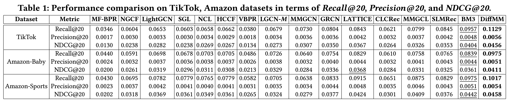
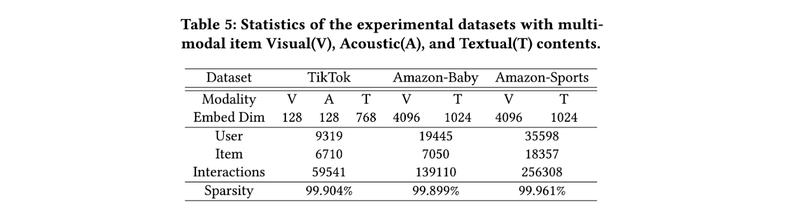

# DiffMM: Multi-Modal Diffusion Model for Recommendation

This is the PyTorch implementation for **DiffMM** proposed in the paper [**DiffMM: Multi-Modal Diffusion Model for Recommendation**](https://arxiv.org/abs/2406.11781), which is accepted by ACM MM 2024 Oral.


In this paper, we propose DiffMM, a new multi-modal recommendation model that enriches the probabilistic diffusion paradigm by incorporating modality awareness. Our approach utilizes a multi-modal graph diffusion model to reconstruct a comprehensive user-item graph, while harnessing the advantages of a cross-modal data augmen- tation module that provides valuable self-supervision signals. To assess the effectiveness of DiffMM, we conducted extensive experi- ments, comparing it to several competitive baselines. The results unequivocally establish the superiority of our approach in terms of recommendation performance, firmly establishing its efficacy.

## 📝 Environment

We develop our codes in the following environment:

- python==3.9.13
- numpy==1.23.1
- torch==1.11.0
- scipy==1.9.1

## 🎯 Experimental Results

Performance comparison of baselines on different datasets in terms of Recall@20, NDCG@20 and Precision@20:



## 🚀 How to run the codes

The command lines to train DiffKG on the three datasets are as below. The un-specified hyperparameters in the commands are set as default.

**! If you want to run the codes on baby or sports dataset, please firstly follow the instrcution in ./Datasets** 

- TikTok

```python
python Main.py --data tiktok --reg 1e-4 --ssl_reg 1e-2 --epoch 50 --trans 1 --e_loss 0.1 --cl_method 1 --conditional_diffusion True --cond_dim 64
```

- Baby

```python
python Main.py --data baby --reg 1e-5 --ssl_reg 1e-1 --keepRate 1 --e_loss 0.01 --conditional_diffusion True --cond_dim 64
```

- Sports

```python
python Main.py --data sports --reg 1e-6 --ssl_reg 1e-2 --temp 0.1 --ris_lambda 0.1 --e_loss 0.5 --keepRate 1 --trans 1 --conditional_diffusion True --cond_dim 64
```

Conditional diffusion can be disabled for ablation with:

```python
python Main.py --data baby --conditional_diffusion False
```

## 👉 Code Structure

```
.
├── README.md
├── Main.py
├── Model.py
├── Params.py
├── DataHandler.py
├── Utils
│   ├── TimeLogger.py
│   └── Utils.py
├── figures
│   ├── model.png
│   ├── dataset.png
│   └── performance.png
└── Datasets
    ├── tiktok
    │   ├── trnMat.pkl
    │   ├── tstMat.pkl
    │   ├── valMat.pkl
    │   ├── audio_feat.npy
    │   ├── image_feat.npy
    │   └── text_feat.npy
    ├── baby
    │   ├── trnMat.pkl
    │   ├── tstMat.pkl
    │   ├── valMat.pkl
    │   ├── text_feat.npy
    │   └── image_feat.npy.zip
    └── README.md
```

## 📚 Datasets



## 🌟 Citation

If you find this work helpful to your research, please kindly consider citing our paper.

```
@article{jiang2024diffmm,
  title={DiffMM: Multi-Modal Diffusion Model for Recommendation},
  author={Jiang, Yangqin and Xia, Lianghao and Wei, Wei and Luo, Da and Lin, Kangyi and Huang, Chao},
  journal={arXiv preprint arXiv:2406.11781},
  year={2024}
}
```
